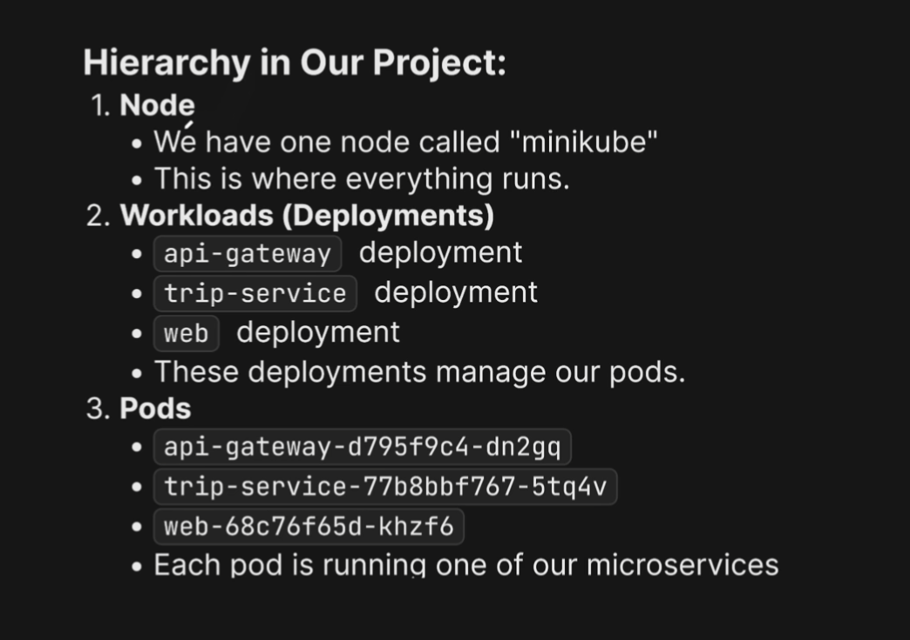
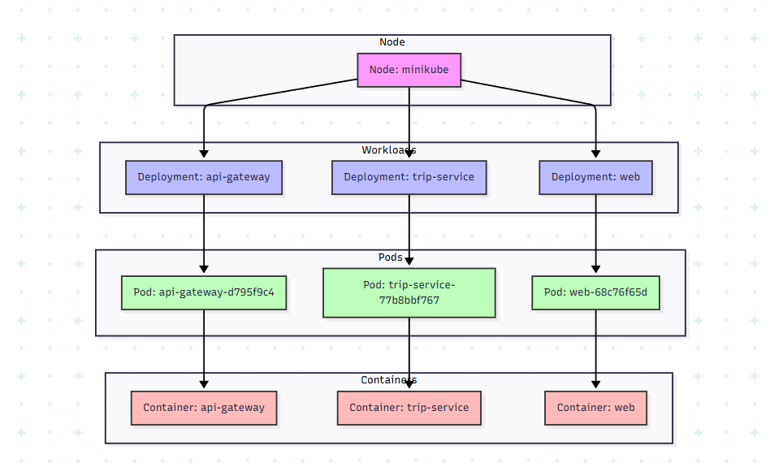

# Complete_microservices_with_go

🚀A learning project building while taking "Complete microservices with go" Udemy course

**Course:** [Complete microservices with go](https://www.udemy.com/course/complete-microservices-with-go)

```bash
go test -v *.go
```


```bash
minikube dashboard
```

```bash
tilt up
```

```bash
go run tools/create_service.go -name test
```
```
Directory structure created:

services/test-service/
├── cmd/                    # Application entry points
├── internal/              # Private application code
│   ├── domain/           # Business domain models and interfaces
│   │   └── test.go         # Core domain interfaces
│   ├── service/          # Business logic implementation
│   │   └── service.go    # Service implementations
│   └── infrastructure/   # External dependencies implementations (abstractions)
│       ├── events/       # Event handling (RabbitMQ)
│       ├── grpc/         # gRPC server handlers
│       └── repository/   # Data persistence
├── pkg/                  # Public packages
│   └── types/           # Shared types and models
└── README.md            # This file
```

###[Kubernetes](https://kubernetes.io/docs/concepts/architecture/)
```bash
kubectl get pods
```

```bash
kubectl get services
```

```bash
kubectl get deployments
```

```bash
kubectl get all | cat
```

```bash
kubectl logs deployment/api-gateway | cat
```

```bash
kubectl describe deployment/api-gateway | cat
```

```bash
kubectl get nodes -o wide
```

```bash
kubectl describe pod {POD_NAME} | grep -A 5 "Conditions:"
```

```bash
kubectl apply -f ./infra/development/k8s/driver-service-deployment.yaml
```

```bash
kubectl delete -f ./infra/development/k8s/driver-service-deployment.yaml
```

```bash
https://docs.stripe.com/stripe-cli
```
```bash
stripe listen --forward-to localhost:8081/webhook/stripe
```





